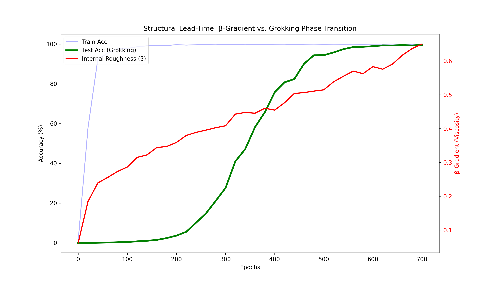
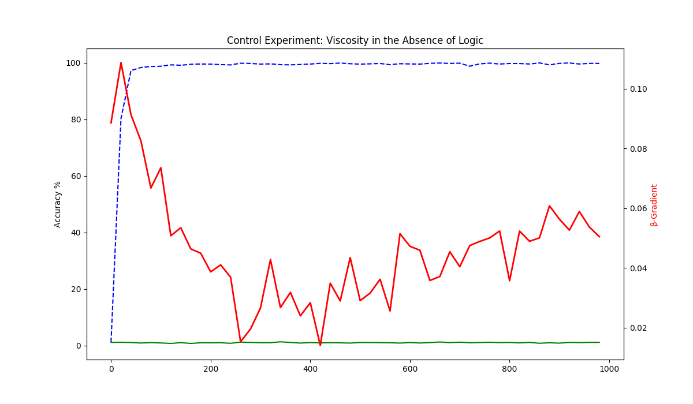

# Grokking-Viscosity: A Geometric Probe for Phase Transitions

(Vibe AI research)

Neural networks exhibit **"grokking"**—a sudden shift from memorization to generalization after prolonged training plateaus. While theoretical frameworks like Singular Learning Theory (SLT) characterize this as a physical phase transition, practical diagnostics for monitoring this "hidden progress" are often computationally expensive.

This repository introduces **β-Sieve**, a zero-shot geometric probe that measures the "informational viscosity" (activation roughness) of a model. It detects the crystallization of internal logic **hundreds of epochs before test accuracy reveals it**.

## Key Discovery

The **β-gradient** measures the difference in spectral roughness between deep and shallow layers.

1. **In Logic-Based Tasks (Modular Addition):** β-viscosity climbs aggressively during the accuracy plateau, signaling the "nucleation" of a generalized circuit.
2. **In Noise-Based Tasks (Scrambled Labels):** β-viscosity remains low and flatlines. The model memorizes the data, but no structural "crystal" forms.

**Conclusion:** Final β-viscosity is **~3.3× higher** when the model is developing understanding versus mere memorization.

## Results Comparison

| Metric | Logic Run (Addition) | Control Run (Scrambled) |
| :--- | :--- | :--- |
| **Final Train Accuracy** | 99.9% | 99.8% |
| **Final Test Accuracy** | 99.6% | 0.8% |
| **Final β-Gradient** | **0.6500** | **0.1983** |

### 1. The Smoking Gun (Real Logic)

In a modular addition task (mod 97), the β-gradient (red) begins its ascent while test accuracy (green) is still near 0%. This is the "structural lead-time".



### 2. The Control (Scrambled Labels)

When labels are randomized, there is no underlying logic to find. While the model memorizes the training set (blue), the β-viscosity (red) fails to surge, proving the probe is specific to emergent structure.



## Why it Works

β-Sieve utilizes a simple discrete derivative (`np.diff`) on internal activations.

- **Gas Phase (Randomness):** Activations are noisy and lack high-frequency coordination.
- **Crystal Phase (Grokking):** Activations develop sharp, specific "texture" as modular circuits lock in.
- The probe captures this transition geometrically without requiring expensive weight-space analysis.

## Repository Contents

- `grokkingwithviscocity2.py`: The long-haul experiment script for modular addition.
- `grokkingcontrolexperiment.py`: The control script using scrambled labels.
- `long_experiment.json`: Raw data from the logic run.
- `control_results.json`: Raw data from the scrambled run.

## Usage

To reproduce the results:

```bash
python grokkingwithviscocity2.py
python grokkingcontrolexperiment.py
```

## References

- Power et al. (2022) — *Grokking: Generalization beyond overfitting on small algorithmic datasets*
- DeMoss et al. (2024) — *Complexity dynamics in neural networks*
- Singular Learning Theory (SLT) foundations regarding phase transitions
